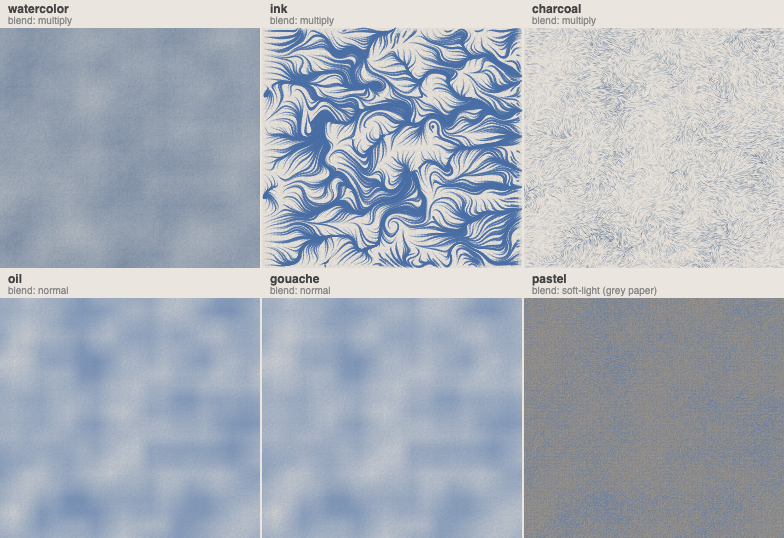
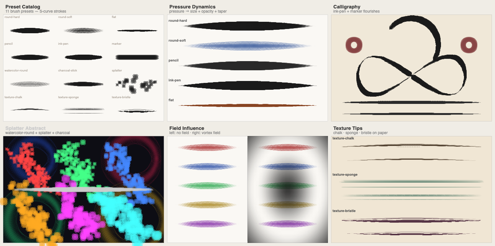
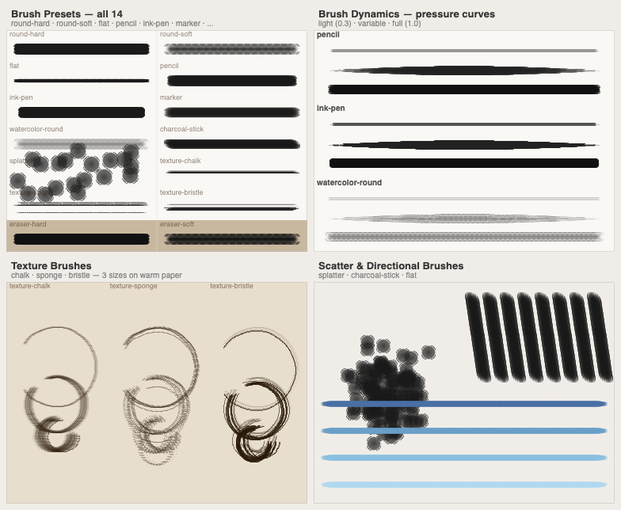
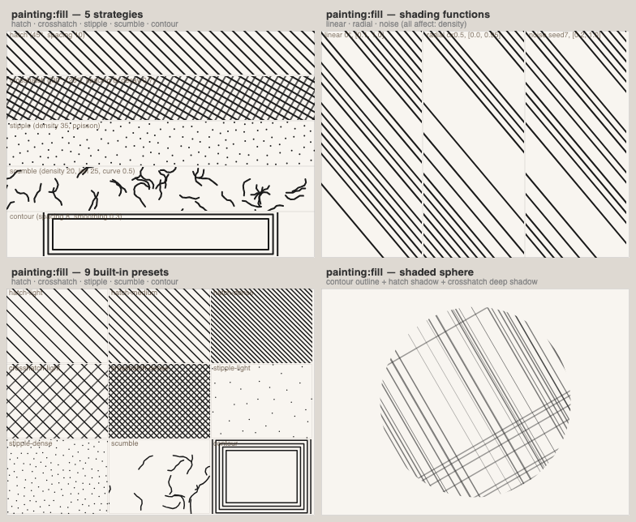

# @genart-dev/plugin-painting

Vector-field-driven painting layer plugin for [genart.dev](https://genart.dev) — overlay painterly media (watercolor, oil, gouache, ink, pastel, charcoal) on any sketch. Each medium simulates its physical analog using a 2D vector flow field to direct brush strokes and pigment. Includes MCP tools for AI-agent control.

**Tier: Pro** — requires a genart.dev Pro subscription for use in the desktop app and editor.

Part of [genart.dev](https://genart.dev) — a generative art platform with an MCP server, desktop app, and IDE extensions.

## Install

```bash
npm install @genart-dev/plugin-painting
```

## Usage

```typescript
import paintingPlugin from "@genart-dev/plugin-painting";
import { createDefaultRegistry } from "@genart-dev/core";

const registry = createDefaultRegistry();
registry.registerPlugin(paintingPlugin);

// Or access individual exports
import {
  watercolorLayerType,
  inkLayerType,
  charcoalLayerType,
  oilAcrylicLayerType,
  gouacheLayerType,
  pastelLayerType,
  paintingMcpTools,
  // Vector field utilities
  noiseField,
  linearField,
  radialField,
  vortexField,
  parseField,
  sampleField,
} from "@genart-dev/plugin-painting";
```

## How It Works

All painting layers are driven by a **vector field** — a 2D grid of direction/magnitude samples that guides how strokes flow across the canvas. The field is defined by a shorthand string:

| Shorthand | Description |
|-----------|-------------|
| `noise:seed:scale:octaves` | Fractal noise field (default: `"noise:0:0.1:3"`) |
| `linear:angleDeg:magnitude` | Uniform directional flow |
| `radial:cx:cy:diverge\|converge` | Radial field expanding or contracting from a point |
| `vortex:cx:cy:radius` | Rotating vortex field |

## Painting Layer Types (6)

All layers share a common set of field, mask, and debug properties.

### Common Properties

| Property | Type | Default | Description |
|----------|------|---------|-------------|
| `field` | string | `"noise:0:0.1:3"` | Vector field shorthand or JSON |
| `fieldCols` | number | `20` | Field grid columns (4–40) |
| `fieldRows` | number | `20` | Field grid rows (4–40) |
| `colors` | string (JSON) | `["#..."]` | Array of hex colors as JSON |
| `opacity` | number | `1` | Layer opacity (0–1) |
| `seed` | number | `0` | Random seed for stroke placement |
| `maskCenterY` | number | `-1` | Vertical mask center in normalized coords |
| `maskSpread` | number | `0.25` | Vertical mask falloff spread |
| `debug` | boolean | `false` | Show vector field debug overlay |

### Watercolor (`painting:watercolor`)

Wet-on-wet watercolor simulation with granulation, backruns, and blooms.

| Property | Type | Default | Description |
|----------|------|---------|-------------|
| `dilution` | number | `0.5` | Water dilution — affects spread and transparency |
| `granulation` | number | `0.3` | Pigment granulation texture |
| `edgeStyle` | select | `"soft"` | `"sharp"`, `"soft"`, `"diffuse"`, `"lost"` |
| `layerCount` | number | `3` | Number of paint layers to composite |

### Oil / Acrylic (`painting:oil`)

Impasto oil painting with thick, directional brush strokes and optional bevel.

| Property | Type | Default | Description |
|----------|------|---------|-------------|
| `impasto` | boolean | `false` | Raised paint bevel effect |
| `brushLength` | number | `80` | Stroke length in pixels |
| `bristles` | number | `12` | Bristle count per stroke |
| `loadFactor` | number | `0.8` | Paint load — affects coverage falloff |

### Gouache (`painting:gouache`)

Opaque matte paint with flat coverage and dry-edge effects.

| Property | Type | Default | Description |
|----------|------|---------|-------------|
| `flatness` | number | `0.8` | Stroke flatness (0 = round, 1 = flat chisel) |
| `dryBrush` | number | `0.2` | Dry-brush edge roughness (0–1) |

### Ink (`painting:ink`)

Flowing ink strokes with tapering and style variation.

| Property | Type | Default | Description |
|----------|------|---------|-------------|
| `weight` | number | `2` | Stroke weight in pixels (0.5–50) |
| `taper` | select | `"none"` | `"none"`, `"head"`, `"tail"`, `"both"` |
| `style` | select | `"fluid"` | `"fluid"`, `"scratchy"`, `"brush"` |

### Pastel (`painting:pastel`)

Soft pastel strokes with blendable chalky texture.

| Property | Type | Default | Description |
|----------|------|---------|-------------|
| `pressure` | number | `0.6` | Stroke pressure — affects pigment density |
| `blending` | number | `0.4` | Color blending with existing layers |
| `grainScale` | number | `2` | Pastel grain texture scale |

### Charcoal (`painting:charcoal`)

Textured charcoal marks with smudging and paper texture interaction.

| Property | Type | Default | Description |
|----------|------|---------|-------------|
| `smudge` | number | `0.3` | Smudge/smear softness |
| `pressure` | number | `0.7` | Mark pressure — affects density |
| `grainScale` | number | `2` | Paper grain scale |

## MCP Tools (4)

Exposed to AI agents through the MCP server when this plugin is registered:

| Tool | Description |
|------|-------------|
| `paint_layer` | Add a painting layer with a specified medium and optional field/color parameters |
| `get_paint_field` | Retrieve the current vector field of a painting layer |
| `update_paint_field` | Update the vector field shorthand on an existing painting layer |
| `generate_field_from_points` | Generate a vector field from a set of control points with directions |

## Vector Field API

The vector field utilities are exported for use in custom rendering pipelines:

```typescript
import {
  noiseField,
  linearField,
  radialField,
  vortexField,
  parseField,
  sampleField,
  divergenceAt,
  curlAt,
  applyVerticalMask,
  type VectorField,
  type VectorSample,
} from "@genart-dev/plugin-painting";

// Generate a field programmatically
const field = noiseField({ cols: 20, rows: 20, seed: 42, scale: 0.1, octaves: 3 });

// Sample at normalized canvas coordinates (0–1)
const sample = sampleField(field, 0.5, 0.5);
// → { dx: number, dy: number, magnitude: number }

// Or parse from shorthand string
const field2 = parseField("vortex:0.5:0.5:0.4", 20, 20);

// Derived quantities (finite-difference approximations)
const div = divergenceAt(field, 0.5, 0.5);   // expansion/contraction
const curl = curlAt(field, 0.5, 0.5);        // rotation strength

// Apply vertical soft mask (restrict paint to a band)
applyVerticalMask(field, { centerY: 0.5, spread: 0.3 });
```

## Examples



All 6 painting media on the same noise field. ([source](test-renders/medium-comparison.genart))

### Brush Stroke System



Preset catalog, pressure dynamics, calligraphy, splatter, field influence, and texture tips. ([source](test-renders/stroke-demos.genart))



All 14 brush presets, pressure curves, texture brushes, and scatter/directional brushes. ([source](test-renders/brush-preset-gallery.genart))

### Fill Styles



Hatch, crosshatch, stipple, scumble, contour strategies with shading functions and presets. ([source](test-renders/fill-styles.genart))

## Render Tests

Regenerate the test images with the [genart CLI](https://github.com/genart-dev/cli):

```bash
bash test-renders/render.sh
# → test-renders/medium-comparison.png
# → test-renders/fill-styles.png
# → test-renders/brush-preset-gallery.png
# → test-renders/stroke-demos.png
```

## Related Packages

| Package | Purpose |
|---------|---------|
| [`@genart-dev/core`](https://github.com/genart-dev/core) | Plugin host, layer system (dependency) |
| [`@genart-dev/plugin-textures`](https://github.com/genart-dev/plugin-textures) | Paper/canvas texture layers to pair with painting layers |
| [`@genart-dev/mcp-server`](https://github.com/genart-dev/mcp-server) | MCP server that surfaces plugin tools to AI agents |

## Support

Questions, bugs, or feedback — [support@genart.dev](mailto:support@genart.dev) or [open an issue](https://github.com/genart-dev/plugin-painting/issues).

## License

MIT
